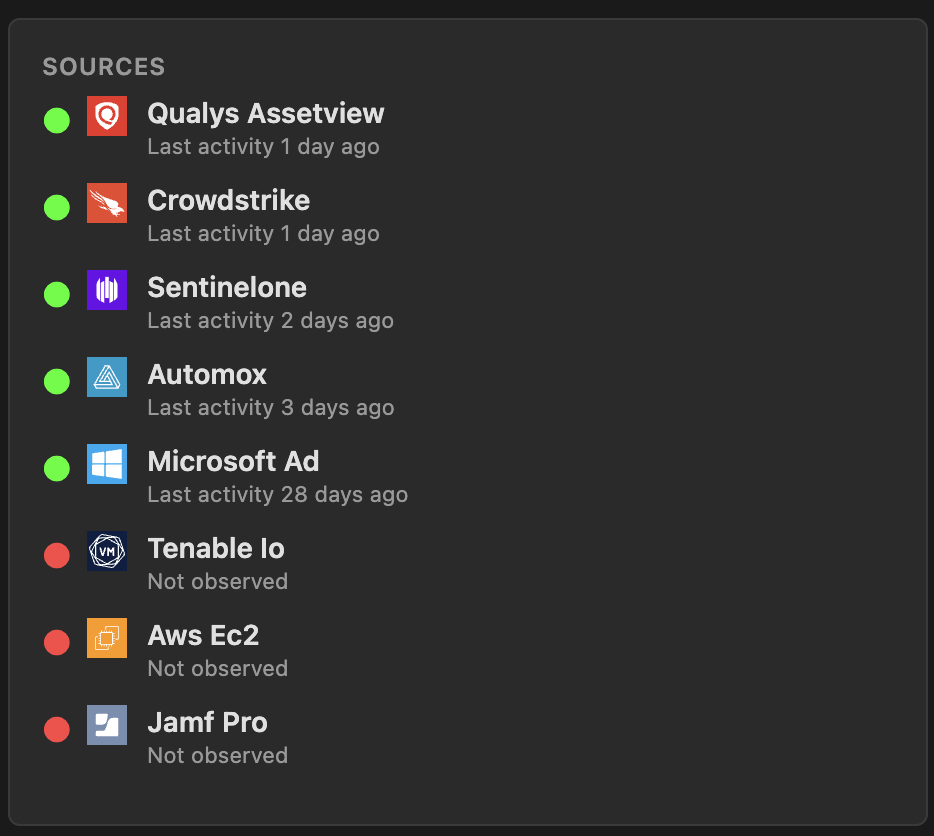

# Sevco for SecOps - Device Lookup Chrome Extension

A Chrome extension that allows security operations teams to quickly look up device and user information from Sevco Security directly from any webpage.

If you are a security analyst, you've inevitably wasted hours and hours starting with just an IP address or hostname and trying to get more device details.  Or you see unusual activity and want to confirm if your EDR platform is active.

Don't waste time any more time!  If your company has Sevco, install this Chrome extension and you can right-click any hostname or IP address to get a quick summary from Sevco right in your SIEM console.  If you want to dig deeper, it's one click to go right to more details than you've ever had before.

## Features

### Device Lookup
- **Right-click search**: Select any hostname or IP address on a webpage, right-click, and select "Look up [text] in Sevco"
- **Intelligent detection**: Automatically detects whether the selected text is a hostname or IPv4 address
- **Comprehensive results**: View detailed device information including:
  - Operating system and version
  - IP addresses (internal and external)
  - Geographic location
  - Last observed and activity timestamps

When multiple devices match your search, you'll see a summary list:

### Source Visibility
- **Observed sources**: See which configured sources have observed this device, with last activity timestamps.  Immediately confirm if your EDR is running or the machine has been scanned by VA.
- **Unobserved sources**: Identify configured sources where the device has NOT been observed

### Security Context
- **Exposure vulnerabilities**: View count of "exposure vulnerabilities" as configured in the Sevco console
- **Associated users**: See details of users observed on the device

### Direct Console Access
- **Quick link**: One-click access to view the full device details in the Sevco console

## Installation

### From Source
1. Clone or download this repository
2. Open Chrome and navigate to `chrome://extensions/`
3. Enable "Developer mode" (toggle in top-right corner)
4. Click "Load unpacked"
5. Select the extension directory

## Configuration

### First-Time Setup
1. After installing, right-click the extension icon in your toolbar
2. Select "Options"
3. Enter your Sevco API Key
4. Click "Fetch Organizations"
5. Select your organization from the dropdown
6. Click "Save Settings"

### Getting Your API Key
1. Log in to the [Sevco Console](https://my.sev.co)
2. Navigate to the API Keys section
3. Generate a new API key
4. Copy the key (it's only shown once!)

## Usage

### Basic Search
1. Highlight any hostname or IP address on a webpage
2. Right-click and select "Look up [text] in Sevco"
3. View the results in the popup

### Viewing Multiple Results
- When multiple devices match your search, you'll see a list view
- Click on any device to see detailed information
- Use the "Back to Results" button to return to the list

## Supported Search Types

### Hostnames
- Uses "contains" matching for flexible searches
- Example: Searching "currant" will find "currant-mire", "blackcurrant-sassy", etc.

### IPv4 Addresses
- Exact match search
- Format: `xxx.xxx.xxx.xxx`
- Example: `152.105.12.254`

## API Endpoints Used

This extension integrates with the following Sevco API endpoints:
- `POST /v3/asset/device` - Device search
- `POST /v3/asset/device/_facet` - Source enumeration
- `POST /v3/asset/user` - User detail lookup
- `GET /v1/admin/org` - Organization information

## Architecture

### Files
- `manifest.json` - Extension configuration
- `background.js` - Service worker for API calls and context menu
- `popup.html` / `popup.js` - Main popup interface
- `options.html` / `options.js` - Settings/configuration page

## Troubleshooting

### "Authentication failed" Error
- Verify your API key is correct in the extension settings
- Ensure your organization ID is properly configured
- Check that your API key hasn't expired

### "No devices found" Error
- Verify the hostname/IP exists in your Sevco instance
- Try a partial hostname search for broader results
- Check your organization has access to the device

### Extension Not Loading
- Ensure developer mode is enabled in `chrome://extensions/`
- Check for any errors in the extension's console
- Try reloading the extension

## Privacy & Security

- API keys are stored securely using Chrome's sync storage
- All API calls are made directly to Sevco's servers
- No data is sent to third parties

## Support

For issues, questions, or feature requests:
- Check the Sevco documentation at [docs.sev.co](https://docs.sev.co)
- Open an issue in this repo or just submit a pull request!
- Contact Sevco support

## License

MIT License

## Acknowledgments

Built with the Sevco Security API. For more information about Sevco Security, visit [www.sevcosecurity.com](https://www.sevcosecurity.com).
